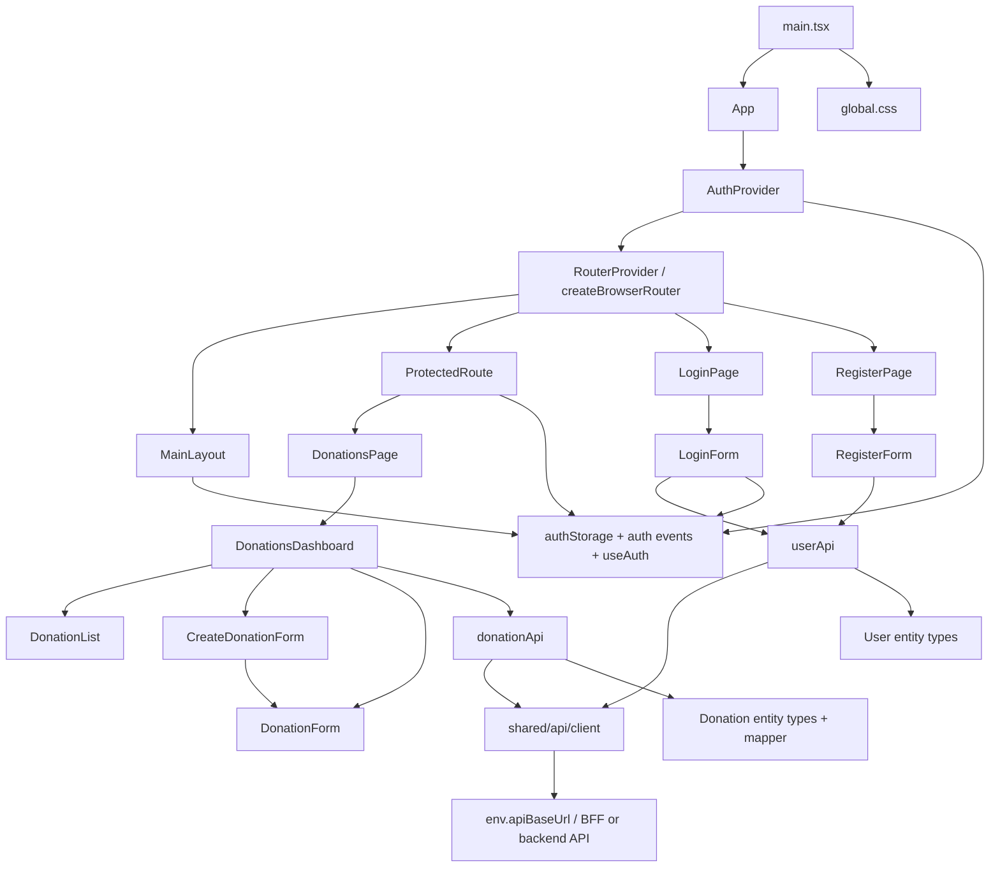
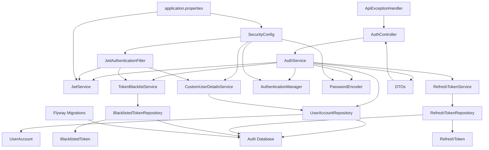
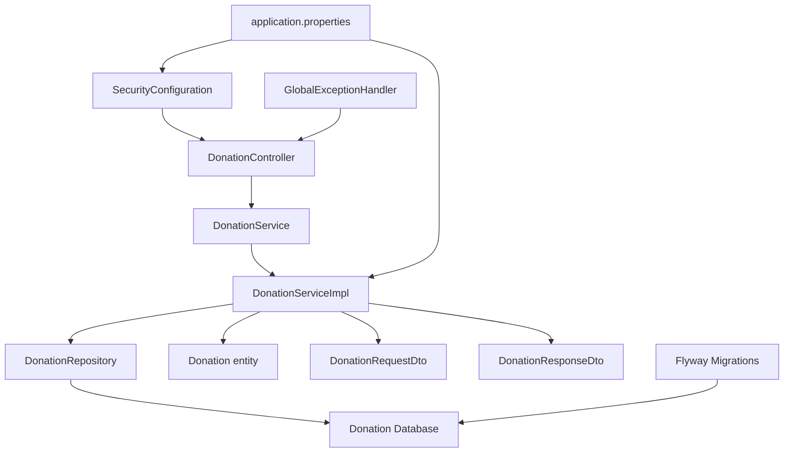

# Diagramas de Componentes

Este documento contiene los diagramas de componentes en formato Mermaid para los contenedores trabajados recientemente en el proyecto:

- Frontend
- Auth Service
- Donation Service

Hacer click derecho en la pestaña de este archivo y seleccionar "Open Preview" para visualizar los diagramas

## Frontend

## Auth Service

## Donation Service

