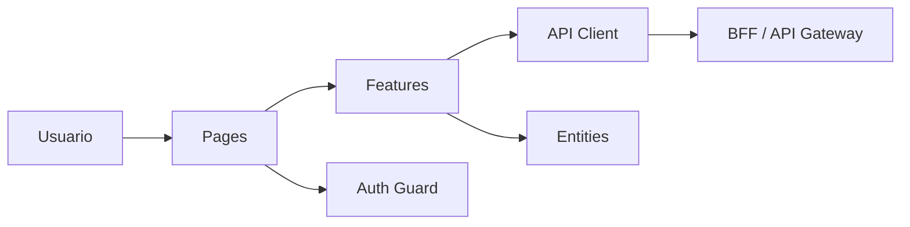
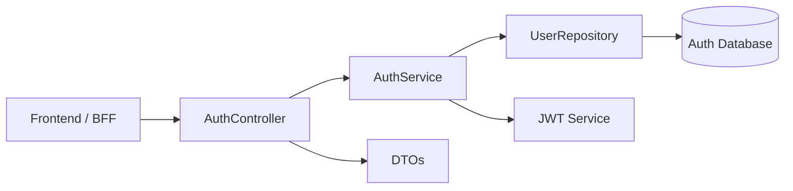
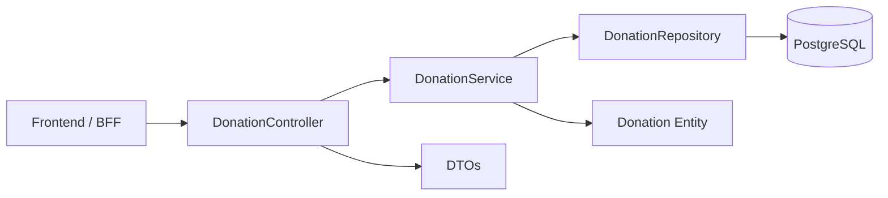
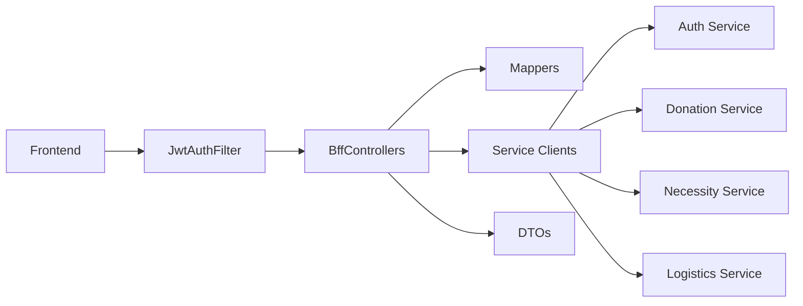
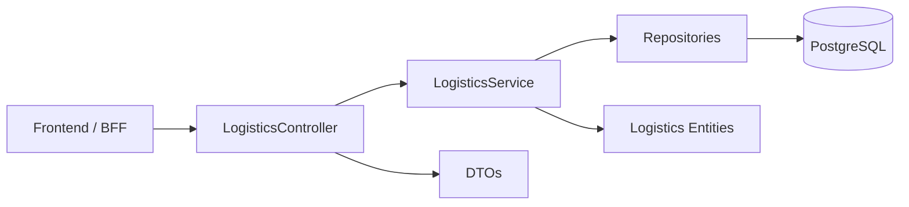

# Diagramas de Componentes

Este documento contiene versiones resumidas de los diagramas de componentes del proyecto en formato Mermaid.

Servicios incluidos:

- Frontend
- BFF
- Auth Service
- Donation Service
- Necessity Service
- Logistics Service

Haz click derecho en la pestaña de este archivo y selecciona "Open Preview" para visualizar los diagramas.

## Frontend

## Auth Service

## Donation Service

## Necessity Service

## BFF

## Logistics Service

